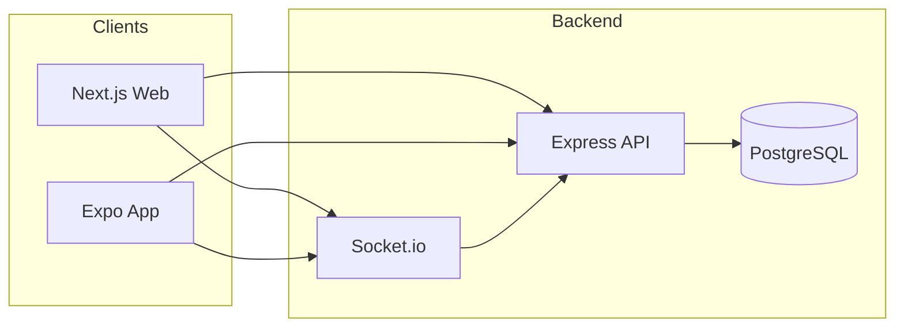

# Realtime Commerce — Checkout & Order Tracking

Monorepo: **web** (Next.js 15), **app** (React Native / Expo), **apis** (Express), **packages/shared** (Zod + types). JWT auth, cart, checkout with optimistic locking, and live order status updates via Socket.io.

## Architecture

- **Clients**: Web (Next.js 15, TanStack Query, Redux, Socket.io client) and Mobile (Expo, Expo Router, secure token storage, Socket.io client).
- **Backend**: Express + TypeScript, Prisma (PostgreSQL), JWT (access + refresh), REST for catalog/cart/checkout/orders/admin, Socket.io for realtime order events.
- **Shared**: `packages/shared` exports Zod schemas and types for auth, products, cart, checkout, orders, admin; used for validation on API and in web/app forms.



## Setup

**Prerequisites**: Node 20+, pnpm, Docker (for DB and optional full stack).

1. Clone and install:
   ```bash
   pnpm install
   ```
2. Copy env and set secrets:
   ```bash
   cp .env.example .env
   # Edit .env: DATABASE_URL, JWT_ACCESS_SECRET, JWT_REFRESH_SECRET, etc.
   ```
3. Database (choose one):
   - **Local PostgreSQL**: Create DB and set `DATABASE_URL`. Then:
     ```bash
     pnpm db:generate
     pnpm db:migrate
     pnpm db:seed
     ```
   - **Docker**: Start DB + APIs:
     ```bash
     docker-compose up -d
     # Then run migrations and seed from host (DATABASE_URL with host localhost):
     pnpm db:generate
     pnpm db:migrate
     pnpm db:seed
     ```
4. Run apps:
   - **Web + APIs**: `pnpm dev` (runs web and apis in parallel).
   - **Mobile**: `pnpm mobile` (Expo). Set `EXPO_PUBLIC_API_URL` to your API URL (e.g. `http://localhost:4000` or your machine IP for a device).

## Env vars (see `.env.example`)

| Variable                                   | Where | Description                          |
| ------------------------------------------ | ----- | ------------------------------------ |
| `DATABASE_URL`                             | apis  | PostgreSQL connection string         |
| `JWT_ACCESS_SECRET` / `JWT_REFRESH_SECRET` | apis  | JWT signing secrets                  |
| `PORT`                                     | apis  | Server port (default 4000)           |
| `CORS_ORIGINS`                             | apis  | Comma-separated origins for web/Expo |
| `NEXT_PUBLIC_API_URL`                      | web   | API base URL for browser             |
| `EXPO_PUBLIC_API_URL`                      | app   | API base URL for mobile              |

## Demo path

1. **Register or login** (web or app).
2. **Browse products** → add items to cart.
3. **Checkout** → fill shipping address and contact; place order.
4. **Order confirmation** → redirect to order detail.
5. **Order tracking**: Open the same order on **web** and **mobile**; watch status update in real time (simulated lifecycle: placed → paid → packed → shipped → delivered).

## How realtime is implemented

- **Socket.io** on the same HTTP server as Express. Clients send JWT in the handshake; server verifies and attaches `userId`, then joins the socket to room `user:${userId}`.
- **Events**: `order.created` and `order.status_updated` (payload: `orderId`, `status`) emitted to the user’s room when an order is created or its status changes.
- **Lifecycle simulation**: After an order is created, an in-process module advances status on a timer (placed → paid → packed → shipped → delivered). In production this would be replaced by a job queue or external fulfillment system.

## Tradeoffs and future

- **Optimistic locking**: Product has a `version` field; checkout runs in a transaction, decrementing stock and incrementing `version` only where the version matches. If any product update affects 0 rows, the transaction rolls back and returns 409. This avoids long-lived row locks; for very high concurrency a queue or reserved-stock model could be added.
- **Realtime**: Single-node Socket.io; for scale, use the Redis adapter so multiple API instances can emit to the same user.
- **Auth**: Access token short-lived (e.g. 15 min), refresh token longer (e.g. 7 days); mobile stores both in secure storage and uses refresh on 401.

## Line-by-line walkthrough checklist

- **Backend**: Express setup and route mounting; auth flow (register/login/refresh, JWT + middleware); checkout (transaction, optimistic locking, Socket emit); Socket.io (JWT auth, rooms, lifecycle module); one unit test (e.g. hash or cart service) and the checkout integration test.
- **Web**: TanStack Query (one query and one mutation example, query keys); React Hook Form + Zod (shared schema) on checkout; Redux (auth, cart UI, socket state); WebSocket hook and how it invalidates orders on `order.status_updated`.
- **Mobile**: API client and 401/refresh; auth and tokens in expo-secure-store; checkout form (RHF + Zod); Socket client and `useOrderUpdates` for live order status.

## Scripts

| Script             | Description                     |
| ------------------ | ------------------------------- |
| `pnpm dev`         | Run web + apis in parallel      |
| `pnpm mobile`      | Start Expo (app)                |
| `pnpm test`        | Run tests in all workspaces     |
| `pnpm build`       | Build shared, then web and apis |
| `pnpm db:generate` | Prisma generate (apis)          |
| `pnpm db:migrate`  | Prisma migrate deploy           |
| `pnpm db:seed`     | Seed DB (apis)                  |
| `pnpm db:studio`   | Open Prisma Studio              |

## API docs

When the APIs server is running, OpenAPI/Swagger UI is at **http://localhost:4000/api-docs**.
