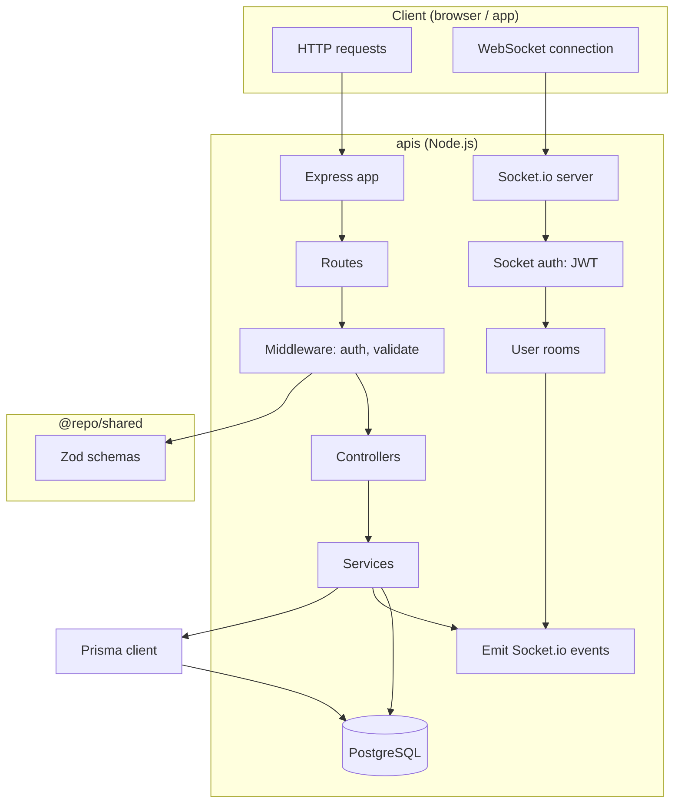
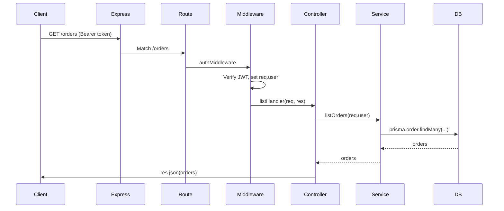

# 01 — Overview & architecture

This doc gives you a **big picture** of the backend: what it does, how a request flows, and where the main pieces live.

---

## What does this backend do?

The **apis** app is a **REST-style API** for a small e-commerce flow:

1. **Users** can register, log in, and get JWT tokens.
2. **Products** can be listed and viewed (with pagination, category, search).
3. **Cart** (per user): add/update/remove items; stock is checked.
4. **Checkout**: turn the cart into an **order**, reserve stock, clear the cart.
5. **Orders**: list and view orders; status can change (placed → paid → packed → shipped → delivered).
6. **Admin**: create/update products; change order status.
7. **Real-time**: after checkout, the frontend can listen for `order.created` and `order.status_updated` over **Socket.io**.

So in one sentence: **HTTP API + WebSockets for auth, products, cart, checkout, orders, and live order updates.**

---

## High-level architecture

- **HTTP:** Client sends requests to Express. They go through **routes → middleware → controllers → services**, then optionally **database** and **Socket.io emit**.
- **WebSocket:** Client connects with a JWT; server puts the socket in a **user room** so it can send events only to that user (e.g. order updates).

---

## Request flow (one HTTP request)

So for a typical protected route:

1. **Express** receives the request and matches the **route** (e.g. `GET /orders`).
2. **Middleware** runs (e.g. **auth**: read Bearer token, verify JWT, attach `req.user`).
3. **Controller** is called; it takes `req`/`res`, gets the user from `req.user`, and calls the **service**.
4. **Service** contains the business logic (e.g. load orders from DB with Prisma).
5. **Controller** sends the result back with `res.json(...)`.

---

## Folder structure (apis)

```mermaid
flowchart LR
  subgraph Entry["Entry & config"]
    index["index.ts"]
    loadEnv["loadEnv.ts"]
    app["app.ts"]
  end

  subgraph Routes["routes/"]
    authRoutes["authRoutes"]
    productRoutes["productRoutes"]
    cartRoutes["cartRoutes"]
    checkoutRoutes["checkoutRoutes"]
    orderRoutes["orderRoutes"]
    adminRoutes["adminRoutes"]
    apiDocs["apiDocs"]
  end

  subgraph Controllers["controllers/"]
    authController["authController"]
    productController["productController"]
    cartController["cartController"]
    checkoutController["checkoutController"]
    orderController["orderController"]
    adminController["adminController"]
  end

  subgraph Services["services/"]
    authService["authService"]
    productService["productService"]
    cartService["cartService"]
    checkoutService["checkoutService"]
    orderService["orderService"]
    orderLifecycle["orderLifecycle"]
    adminService["adminService"]
  end

  subgraph Middleware["middleware/"]
    auth["auth"]
    validate["validate"]
    errorHandler["errorHandler"]
  end

  subgraph Utils["utils/"]
    jwt["jwt"]
    hash["hash"]
    errors["errors"]
    logger["logger"]
  end

  subgraph Lib["lib/"]
    prisma["prisma"]
  end

  index --> loadEnv
  index --> app
  index --> socket
  app --> Routes
  Routes --> Middleware
  Routes --> Controllers
  Controllers --> Services
  Services --> Lib
  Services --> Utils
  Middleware --> Utils
```

| Folder / file | Purpose (simple explanation) |
|---------------|--------------------------------|
| **index.ts** | Starts the app: loads env, creates HTTP server, attaches Socket.io, sets `app.set("io", io)`, starts listening. |
| **loadEnv.ts** | Loads `.env` from current or parent directory so `process.env` has `DATABASE_URL`, `JWT_*`, etc. |
| **app.ts** | Builds the Express app: CORS, JSON, cookies, mounts all **routes**, health, api-docs, then **errorHandler**. |
| **routes/** | Map URL + method to **controller** functions; apply **middleware** (auth, validate). |
| **controllers/** | Handle `req`/`res`: read params/body/user, call **services**, send JSON or pass errors to `next`. |
| **services/** | Business logic: talk to DB (Prisma), call **utils** (hash, jwt), optionally emit Socket.io. |
| **middleware/** | **auth**: JWT verification, `requireAdmin`. **validate**: Zod on body/query/params. **errorHandler**: turn errors into JSON. |
| **utils/** | **jwt**: sign/verify tokens. **hash**: bcrypt. **errors**: `AppError`. **logger**: Pino. |
| **lib/** | **prisma**: single Prisma client instance used by all services. |
| **socket.ts** | Attach Socket.io to the HTTP server; auth via JWT; join socket to `user:${userId}` room. |
| **prisma/** | **schema.prisma**: data model. **migrations/**: SQL. **seed.ts**: demo user + products. |

---

## API surface (routes)

| Prefix | Purpose | Auth |
|--------|--------|------|
| `/auth` | register, login, refresh, me | me + refresh need token/cookie |
| `/products` | list, get by id | none |
| `/cart` | get cart, add/update/remove items | JWT |
| `/checkout` | POST create order from cart | JWT |
| `/orders` | list, get by id | JWT (own only) |
| `/admin` | products CRUD, order status | JWT + admin |
| `/health` | health check | none |
| `/api-docs` | Swagger UI + OpenAPI JSON | none |

---

## Data flow summary

- **Auth:** Register/Login → hash password, create/load user → sign access + refresh JWT → return tokens (and store refresh in DB).
- **Cart:** All operations are per **user** (from JWT); cart is created on first use; items reference **products**; stock is checked on add/update.
- **Checkout:** Load cart → in a **transaction**: decrement product stock (with **optimistic locking** via `Product.version`), create **order** and **order items**, clear cart → emit `order.created` → start **order lifecycle** (demo status progression).
- **Orders:** List/fetch filtered by `userId` (or admin can change status); status updates emit `order.status_updated` to the user’s Socket.io room.

Next: [02 — Entry point & Express app](./02-entry-and-app.md) (how the server starts and how the app is wired).
