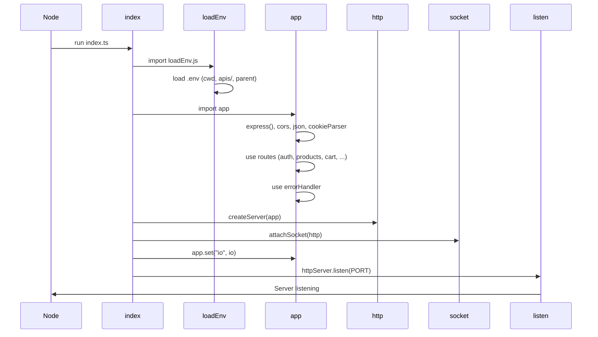
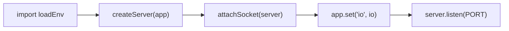
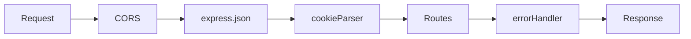

# 02 — Entry point & Express app

This doc explains **how the server starts** and **how the Express app is set up**: env loading, HTTP server, Socket.io attachment, and route mounting.

---

## Startup flow

---

## 1. `index.ts` — entry point

**File:** `apis/src/index.ts`

This is the **only file** that actually starts the server. It:

1. **Loads environment variables** by importing `loadEnv.js` first (so `process.env` is ready).
2. **Creates an HTTP server** with Node’s `createServer(app)` (Express `app` is the request handler).
3. **Attaches Socket.io** to that same server via `attachSocket(httpServer)`.
4. **Stores the Socket.io instance** on the Express app with `app.set("io", io)` so controllers (e.g. checkout, admin) can emit to users.
5. **Starts listening** on `PORT` (default 4000).

Important: the app **does not** call `app.listen()` itself. The **HTTP server** is created explicitly so that **Socket.io** can attach to the same server. Both HTTP and WebSocket then use the same port.

---

## 2. `loadEnv.ts` — environment variables

**File:** `apis/src/loadEnv.ts`

**Why it exists:** Other modules use `process.env.DATABASE_URL`, `process.env.JWT_ACCESS_SECRET`, etc. Those come from a `.env` file. `dotenv` reads that file and fills `process.env`. We need that to happen **before** any code that uses env vars runs.

**What it does:** It tries to load `.env` from:

1. Current working directory (e.g. repo root or `apis/`)
2. `apis/.env`
3. Parent directory `../.env`

So whether you run `pnpm dev` from the repo root or from `apis/`, one of these paths should find your `.env`.

**Typical env vars used by the backend:**

| Variable | Purpose |
|----------|--------|
| `DATABASE_URL` | PostgreSQL connection string (used by Prisma) |
| `JWT_ACCESS_SECRET` | Secret to sign/verify access tokens |
| `JWT_REFRESH_SECRET` | Secret to sign/verify refresh tokens |
| `JWT_ACCESS_EXPIRES_IN` | e.g. `15m` |
| `JWT_REFRESH_EXPIRES_IN` | e.g. `7d` |
| `CORS_ORIGINS` | Comma-separated origins (e.g. `http://localhost:3000`) |
| `PORT` | Server port (default 4000) |
| `LOG_LEVEL` | Pino level (e.g. `info`, `debug`) |
| `NODE_ENV` | `development` / `production` |

---

## 3. `app.ts` — Express application

**File:** `apis/src/app.ts`

This file **creates and configures** the Express app but **does not listen**. It’s used by:

- **index.ts** — passes it to `createServer(app)` and mounts Socket.io.
- **Tests** — they can import `app` and use it with `supertest` without starting a real server.

### Middleware order

1. **cors** — Allows requests from origins in `CORS_ORIGINS` (or `http://localhost:3000`), with `credentials: true` for cookies.
2. **express.json()** — Parses `Content-Type: application/json` body into `req.body`.
3. **cookieParser()** — Parses `Cookie` header into `req.cookies` (used for refresh token).
4. **Routes** — All API routes are mounted under path prefixes (see below).
5. **errorHandler** — Last; catches any error passed to `next(err)` and sends a JSON response (`statusCode`, `message`, optional `details`).

### Route mounting

| Path | Module | Purpose |
|------|--------|--------|
| `/auth` | authRoutes | register, login, refresh, me |
| `/products` | productRoutes | list, get by id |
| `/cart` | cartRoutes | get, add/update/remove items |
| `/checkout` | checkoutRoutes | POST checkout |
| `/orders` | orderRoutes | list, get by id |
| `/admin` | adminRoutes | admin products & order status |
| `/health` | (inline) | `GET /health` → `{ ok: true }` |
| `/api-docs` | apiDocsRoutes | Swagger UI + OpenAPI JSON |

The **error handler** is registered **after** all routes so that any `next(err)` from a route or middleware ends up there.

---

## Why `app.set("io", io)`?

Socket.io is created in `index.ts` **after** the Express app exists. Controllers (e.g. checkout, admin order status) need to **emit** events to the connected client (e.g. `order.created`, `order.status_updated`). So we need a way to get the **io** instance inside a request handler.

Express allows storing app-level values with `app.set(key, value)` and `app.get(key)`. So:

- In **index.ts**: `app.set("io", io)`.
- In a **controller**: `const io = req.app.get("io")` (or similar), then `io.to(`user:${userId}`).emit(...)`.

That way, HTTP and WebSocket stay on the same server and share the same `io` instance.

---

Next: [03 — Database (Prisma)](./03-database.md) (data models, relations, migrations, seed).
