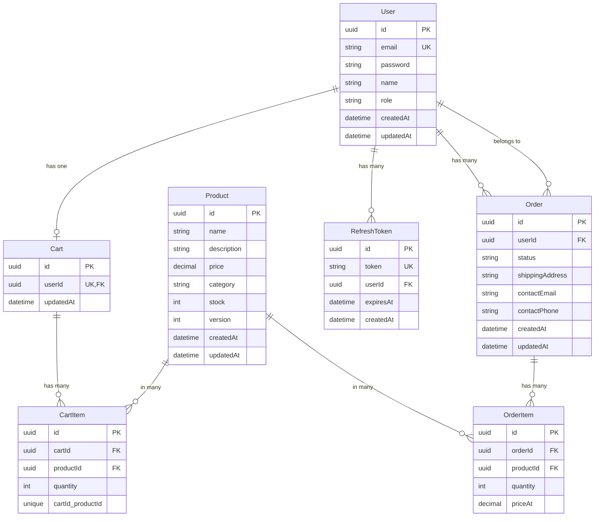
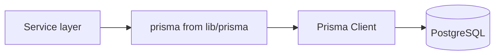

# 03 — Database (Prisma)

This doc explains how the backend talks to the database: **Prisma** as the ORM, the **schema** (tables and relations), **migrations**, and the **seed** script.

---

## What is Prisma?

**Prisma** is an **ORM** (Object–Relational Mapper). Instead of writing raw SQL, you:

1. Define a **schema** (models = tables, fields = columns, relations).
2. Run **migrations** to create/update the real database.
3. Use the **Prisma client** in code to run queries (e.g. `prisma.user.findMany()`).

The schema lives in `apis/prisma/schema.prisma`. The client is generated into `node_modules/.prisma` and used from `apis/src/lib/prisma.ts`.

---

## Schema overview

---

## Models (tables) in plain English

| Model | Purpose |
|-------|--------|
| **User** | One row per account. `email` unique, `password` is bcrypt hash, `role` is `"user"` or `"admin"`. |
| **RefreshToken** | Stored refresh tokens for “remember me” / token refresh. Linked to `User`; has `expiresAt`. |
| **Product** | Catalog item: name, description, price, category, **stock**, and **version** (used for optimistic locking on checkout). |
| **Cart** | One cart per user (`userId` unique). Created on first cart operation. |
| **CartItem** | Line in a cart: which product, how many. Unique per (cart, product). |
| **Order** | One order per checkout: user, status, shipping/contact, created/updated. |
| **OrderItem** | Line in an order: product, quantity, **priceAt** (price at time of order). |

---

## Important details

### IDs

- All main tables use `@id @default(uuid())`: primary key is a UUID string (e.g. `"550e8400-e29b-41d4-a716-446655440000"`).

### User ↔ Cart

- **One-to-one**: each user has at most one cart (`userId` unique on `Cart`). Relation: `User` has `cart Cart?`, `Cart` has `user User`.

### User ↔ Order

- **One-to-many**: one user has many orders. `Order.userId` points to `User`.

### Product.version (optimistic locking)

- On **checkout**, we decrement `Product.stock` and **increment `Product.version`**. The update uses `where: { id, version }`. If someone else already changed that row, `version` won’t match and the update affects 0 rows → we throw and ask the user to retry. This avoids overselling when two checkouts run at once.

### Order status

- Stored as a string; allowed values: `placed` → `paid` → `packed` → `shipped` → `delivered`. The **order lifecycle** service (and admin) update this and emit Socket.io events.

### OrderItem.priceAt

- When we create an order, we copy the **current product price** into each `OrderItem.priceAt`. So even if the product price changes later, the order keeps the price at purchase time.

---

## Where the schema and client live

| What | Where |
|------|--------|
| Schema | `apis/prisma/schema.prisma` |
| Migrations | `apis/prisma/migrations/` (SQL per migration) |
| Generated client | After `prisma generate`, used via `import { prisma } from "../lib/prisma.js"` |
| Single client instance | `apis/src/lib/prisma.ts` creates one `PrismaClient` and exports it |

---

## Migrations

- **Create/apply migrations (dev):** `pnpm db:migrate` (or from repo root, from the `apis` package). This runs `prisma migrate dev`: applies pending migrations and regenerates the client.
- **Apply in production:** `pnpm db:deploy` runs `prisma migrate deploy` (no interactive prompts).
- Migration SQL is under `prisma/migrations/<name>/migration.sql`. Never edit the DB by hand if you use migrations; change the schema and create a new migration.

---

## Seed

**File:** `apis/prisma/seed.ts`

**Purpose:** Fill the database with initial data for development/demo.

**What it does:**

1. **Users:** Upserts a demo user (`demo@example.com` / `demo1234`) and an admin (`admin@example.com` / `admin1234`). Passwords are hashed with bcrypt (same as in auth).
2. **Products:** If there are no products, creates a set of sample products (Electronics, Clothing, Home) with name, description, price, category, stock.

Run with: `pnpm db:seed` (from repo root or from `apis`). This uses the `prisma` config in `apis/package.json` (`"seed": "tsx prisma/seed.ts"`).

---

## How the app uses the database

- Every **service** that needs the DB imports the same **prisma** instance from `lib/prisma.ts`.
- No raw SQL in app code; all access goes through Prisma (e.g. `prisma.user.findUnique`, `prisma.order.create`, `prisma.$transaction`).

Next: [04 — Authentication](./04-auth.md) (register, login, JWT, refresh tokens).
