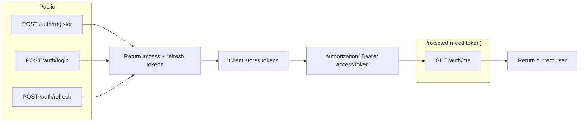
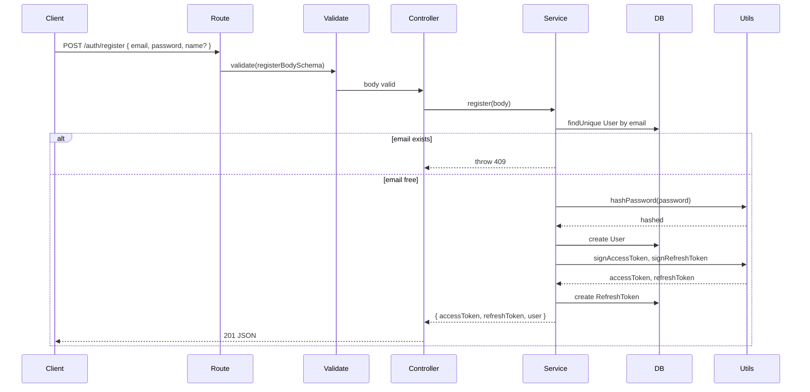
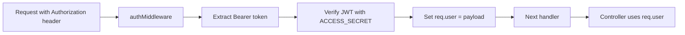

# 04 — Authentication

This doc explains how **authentication** works: register, login, **JWT** (access + refresh), and how protected routes get the current user.

---

## Auth flow (big picture)

- **Register / Login** return an **access token** (short-lived) and a **refresh token** (long-lived, stored in DB).
- **Refresh** takes a refresh token (body or cookie) and returns **new** access (and optionally refresh) tokens.
- **Me** needs the **access token** in the `Authorization: Bearer <token>` header; the server returns the current user (id, email, name, role).

---

## Register flow

1. **Validation** (Zod): `email`, `password`, optional `name` (schemas from `@repo/shared`).
2. **Service:** If email already exists → 409. Otherwise hash password (bcrypt), create user, sign access + refresh tokens, store refresh token in DB, return tokens + user info.
3. **Controller:** Sends 201 and the JSON result.

---

## Login flow

Same idea as register, but:

- Find user by **email**.
- **Verify password** with bcrypt (`verifyPassword(plain, user.password)`).
- If wrong → 401. If OK → sign access + refresh, store refresh in DB, return tokens + user.

---

## Refresh flow

**Purpose:** Access tokens expire quickly (e.g. 15m). Instead of making the user log in again, the client sends the **refresh token**; the server checks it and returns **new** tokens.

1. Client sends refresh token in **body** (`refreshToken`) or **cookie** (`refreshToken`).
2. Server **verifies** the JWT with `JWT_REFRESH_SECRET`.
3. Server looks up the token in **RefreshToken** table; if missing or expired → 401. Optionally deletes old row (rotation).
4. Server issues **new** access token and **new** refresh token; stores the new refresh in DB; returns both + user.

---

## What is a JWT?

**JWT** = JSON Web Token. It’s a **signed** string with three parts (base64): **header.payload.signature**.

- **Payload** usually contains: `sub` (user id), `email`, `role`, `exp` (expiry), `iat` (issued at).
- **Signature** is computed with a **secret** (e.g. `JWT_ACCESS_SECRET`). Anyone with the secret can **verify** that the token wasn’t tampered with and that it’s not expired.

So the server **does not** store the access token; it only **verifies** it when the client sends it in `Authorization: Bearer <token>`.

---

## Two tokens: access vs refresh

| Token | Secret | Typical expiry | Stored in DB? | Use |
|-------|--------|-----------------|---------------|-----|
| **Access** | `JWT_ACCESS_SECRET` | Short (e.g. 15m) | No | Every API request: `Authorization: Bearer <accessToken>` |
| **Refresh** | `JWT_REFRESH_SECRET` | Long (e.g. 7d) | Yes (RefreshToken table) | Only to get new access (and optionally new refresh) |

If the access token expires, the client calls **POST /auth/refresh** with the refresh token and gets a new access token (and optionally a new refresh token). So the user stays “logged in” without typing the password again.

---

## How protected routes get the user

- **authMiddleware** (in `middleware/auth.ts`):
  - Reads `Authorization: Bearer <token>`.
  - Verifies the token with `JWT_ACCESS_SECRET` (see **utils/jwt.ts**).
  - On success: sets `req.user` to the **payload** (e.g. `{ sub, email, role }`). `sub` is the user id.
  - On missing/invalid token: calls `next(AppError(401, ...))`.
- Controllers then use `req.user` (e.g. `req.user.sub` as `userId` for cart, orders, checkout).

---

## Auth routes summary

| Method | Path | Auth | Purpose |
|--------|------|------|--------|
| POST | /auth/register | No | Register; body: email, password, name?; returns tokens + user. |
| POST | /auth/login | No | Login; body: email, password; returns tokens + user. |
| POST | /auth/refresh | No | Body or cookie: refreshToken; returns new tokens + user. |
| GET | /auth/me | Yes (Bearer) | Returns current user (id, email, name, role). |

---

## Files involved

| File | Role |
|------|------|
| **routes/authRoutes.ts** | Mounts POST register/login/refresh, GET me; applies validate + auth middleware. |
| **controllers/authController.ts** | Calls authService register/login/refresh/me; sends JSON or passes errors. |
| **services/authService.ts** | register: hash, create user, sign tokens, store refresh. login: verify password, sign tokens. refresh: verify refresh, optional rotation, new tokens. |
| **middleware/auth.ts** | authMiddleware: verify Bearer JWT, set req.user. requireAdmin: require req.user.role === "admin". |
| **utils/jwt.ts** | signAccessToken, signRefreshToken, verifyToken. |
| **utils/hash.ts** | hashPassword (bcrypt), verifyPassword. |

Validation schemas (e.g. `registerBodySchema`, `loginBodySchema`) live in **packages/shared** and are used by the **validate** middleware.

Next: [05 — Routes, controllers, services](./05-routes-controllers-services.md) (how a request becomes a response).
