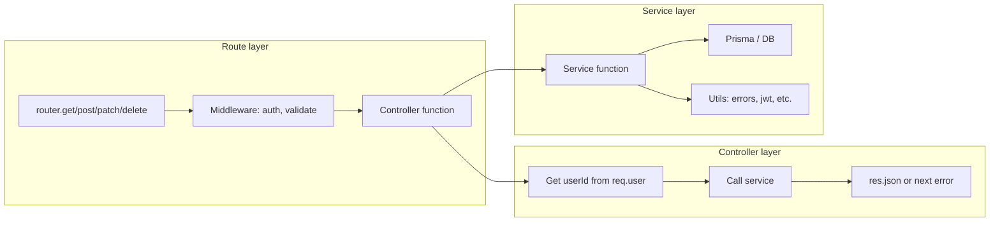
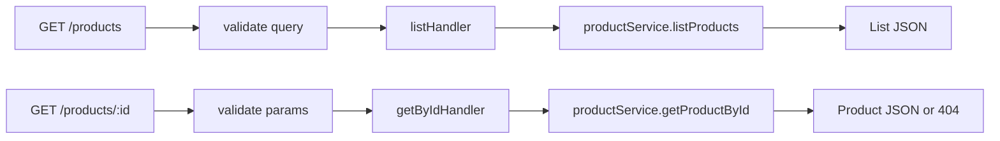
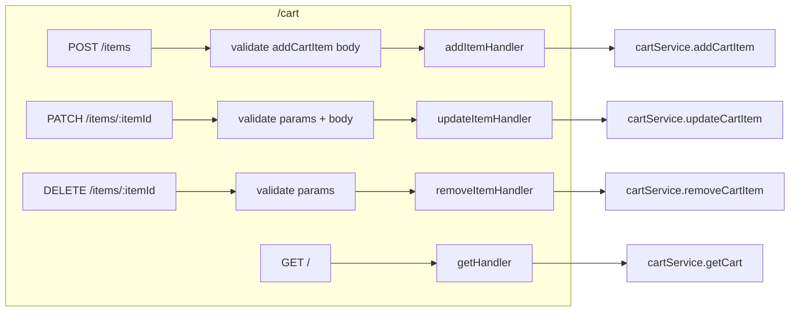

# 05 — Routes, controllers, services

This doc explains the **three-layer pattern**: **routes** (URL + method → handler), **controllers** (handle req/res, call services), and **services** (business logic + DB). We’ll go through each domain (products, cart, orders, admin) with the same structure.

---

## The pattern in one picture

- **Route:** Binds URL + HTTP method to a **controller function** and runs **middleware** (auth, validation) first.
- **Controller:** Reads `req` (params, body, query, `req.user`), calls **one service**, then sends the response or passes an error to `next(err)`.
- **Service:** Contains the real logic: DB (Prisma), validation, and sometimes Socket.io emit. No `req`/`res` here.

---

## Why split it this way?

| Layer | Responsibility | Doesn’t do |
|-------|----------------|------------|
| **Route** | “For this URL and method, run these middlewares and this handler.” | No business logic, no DB. |
| **Controller** | “Parse request, get user, call service, send response or forward error.” | No SQL/Prisma, no complex logic. |
| **Service** | “Implement the use case: load/save data, rules, side effects.” | No HTTP (no res.json, no status codes). |

Benefits: **test services** without HTTP; **reuse services** from other entry points (e.g. a job); **clear place** for validation (middleware) vs logic (service).

---

## Products (public, no auth)

- **GET /products** — Query params: `page`, `limit`, `category`, `sort`, `search`. Validation via `productsQuerySchema` on `query`. Controller calls `listProducts(query)`; service uses Prisma to find products (with filters), count, and distinct categories; returns `{ data, total, page, limit, categories }`.
- **GET /products/:id** — Params validated with `productIdParamSchema`. Controller calls `getProductById(id)`; if null, controller calls `next(AppError(404, "Product not found"))`; else `res.json(product)`.

---

## Cart (all routes require JWT)

- **router.use(authMiddleware)** — So every cart route gets `req.user` (from JWT). Controllers take `userId = req.user.sub`.
- **GET /cart** — Get or create cart for that user; return cart with items and product details.
- **POST /cart/items** — Body: `productId`, `quantity`. Service checks product exists and stock, then add or merge quantity; returns updated cart.
- **PATCH /cart/items/:itemId** — Body: `quantity`. If 0, remove item; else update quantity (and check stock); return cart.
- **DELETE /cart/items/:itemId** — Remove that line; return cart.

All cart responses are the **full cart** (with items and product info) so the client can refresh the cart UI.

---

## Checkout (one route)

- **POST /checkout** — Middleware: auth, then validate body (`shippingAddress`, `contactEmail`, `contactPhone?`). Controller gets `userId` from `req.user`, calls `checkout(userId, body, io)`. Service runs the **transaction** (see [07-checkout-and-orders](./07-checkout-and-orders.md)); then controller calls `startOrderLifecycle(order.id, io)` and returns `201` with the order. So: **one route → one controller → checkout service + order lifecycle**.

---

## Orders (list + get by id)

- **GET /orders** — Auth only. Controller calls `listOrders(req.user)`; service does `prisma.order.findMany({ where: { userId: user.sub }, include: items + product })`; controller returns the array.
- **GET /orders/:id** — Auth + validate `id` in params. Controller calls `getOrderById(id, req.user)`; service loads order; if not found → 404; if `order.userId !== user.sub` and user is not admin → 403; else return order.

---

## Admin (JWT + role admin)

- **router.use(authMiddleware, requireAdmin)** — So every admin route has `req.user` and `req.user.role === "admin"`.
- **POST /admin/products** — Validate create-product body; controller calls `createProduct(body)`; service does `prisma.product.create(...)`; return 201 + product.
- **PATCH /admin/products/:id** — Validate params + update body; controller calls `updateProduct(id, body)`; service does find + partial update; return product.
- **PATCH /admin/orders/:id/status** — Validate params + body `{ status }`; controller gets `io` from `req.app.get("io")`, calls `setOrderStatus(id, body, io)`; service updates order and emits `order.status_updated` to the user’s room; return order.

---

## Error handling in controllers

Controllers typically:

1. Call the service inside `try/catch`.
2. If the caught value is an `AppError` (has `statusCode`), call `next(e)` so the **error handler** middleware sends the right status and JSON.
3. Otherwise call `next(e)` or `next(new AppError(400, "Invalid body"))` so unknown errors become 500 in the error handler.

So **services** throw `AppError` (e.g. 404, 409); **controllers** don’t set status codes manually for those—the global error handler does.

---

## Summary table

| Domain | Routes file | Controller | Service(s) |
|--------|-------------|------------|------------|
| Auth | authRoutes | authController | authService |
| Products | productRoutes | productController | productService |
| Cart | cartRoutes | cartController | cartService |
| Checkout | checkoutRoutes | checkoutController | checkoutService, orderLifecycle |
| Orders | orderRoutes | orderController | orderService |
| Admin | adminRoutes | adminController | adminService, orderService |

Next: [06 — Middleware](./06-middleware.md) (auth, validate, error handler).
