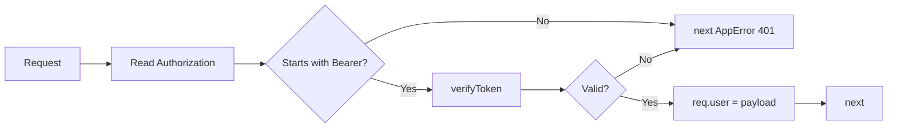
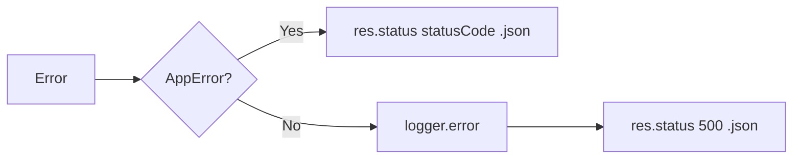

# 06 — Middleware

This doc explains the **middleware** used in the backend: **auth** (JWT + admin), **validate** (Zod on body/query/params), and **errorHandler** (turn errors into JSON responses).

---

## What is middleware?

**Middleware** is a function that runs **between** receiving the request and sending the response. It receives `(req, res, next)`. It can:

- **Read or change** `req` / `res`.
- **Call `next()`** to pass control to the next middleware or the final route handler.
- **Call `next(err)`** to skip to the **error handler** (the one with four arguments: `err, req, res, next`).

Order matters: middleware runs in the order it’s registered. For example, we want **auth** to run before the **controller**, so the controller can assume `req.user` is set on protected routes.

---

## Middleware flow (concept)

```mermaid
flowchart LR
  req[Incoming request] --> M1[Middleware 1]
  M1 --> next1{next()?}
  next1 -->|yes| M2[Middleware 2]
  M2 --> next2{next()?}
  next2 -->|yes| Handler[Route handler]
  Handler --> res[Response]
  next1 -->|next err| ErrorHandler[Error handler]
  next2 -->|next err| ErrorHandler
  Handler -->|next err| ErrorHandler
  ErrorHandler --> errRes[JSON error response]
```

So: **auth** and **validate** are “normal” middleware (they call `next()` or `next(err)`). The **error handler** is the last middleware and only runs when someone calls `next(err)`.

---

## 1. Auth middleware

**File:** `apis/src/middleware/auth.ts`

### authMiddleware

**Purpose:** For protected routes, ensure the request has a valid **access JWT** and attach the decoded payload to `req.user`.

**How it works:**

1. Read `Authorization` header. Expect format: `Bearer <token>`.
2. If missing or not starting with `"Bearer "` → `next(AppError(401, "Missing or invalid Authorization header"))`.
3. Extract the token (everything after `"Bearer "`).
4. Call `verifyToken(token, JWT_ACCESS_SECRET)`. If verification throws (invalid or expired) → `next(AppError(401, "Invalid or expired token"))`.
5. Otherwise set `(req as any).user = payload` (payload has `sub`, `email`, `role`) and call `next()`.

So after this middleware, **controllers** can use `req.user.sub` as the current user id.



### requireAdmin

**Purpose:** Use **after** `authMiddleware` on admin routes. Ensures `req.user.role === "admin"`.

**How it works:** If `!req.user` or `req.user.role !== "admin"` → `next(AppError(403, "Admin access required"))`. Otherwise `next()`.

**Usage:** In admin routes: `router.use(authMiddleware, requireAdmin)` so every admin route first gets a user, then checks admin.

---

## 2. Validate middleware

**File:** `apis/src/middleware/validate.ts`

**Purpose:** Validate `req.body`, `req.query`, or `req.params` with a **Zod** schema. If valid, replace that part of `req` with the parsed result (so you get typed and coerced values). If invalid, call `next(AppError(400, message, details))`.

**Signature:** `validate(schema, source)` where `source` is `"body"` (default), `"query"`, or `"params"`.

**How it works:**

1. Run `schema.safeParse(req[source])`.
2. If `result.success` is true: set `req[source] = result.data` and `next()`.
3. If false: build a message from `result.error.errors`, optionally attach `result.error.flatten()` as details, then `next(new AppError(400, message, details))`.

**Example:**  
`validate(registerBodySchema)` on POST /auth/register runs Zod on `req.body`; the controller then gets a validated body (e.g. email string, password string). Schemas live in `@repo/shared` (e.g. `registerBodySchema`, `productsQuerySchema`, `checkoutBodySchema`).

```mermaid
flowchart LR
  req[Request] --> Parse[schema.safeParse req body/query/params]
  Parse --> Ok{Success?}
  Ok -->|Yes| Assign[req[source] = result.data]
  Assign --> Next[next]
  Ok -->|No| Err400[next AppError 400 + message]
```

---

## 3. Error handler

**File:** `apis/src/middleware/errorHandler.ts`

**Purpose:** Central place to turn **any** error passed to `next(err)` into a **JSON response** with a status code and a consistent shape. Also log unexpected errors.

**How it works:**

1. If `err instanceof AppError`: send `res.status(err.statusCode).json({ statusCode, message, details? })`.
2. Otherwise: log the error with the logger, then send `res.status(500).json({ statusCode: 500, message: "Internal server error" })`.

So **AppError** is the only way the application intentionally sends non-500 errors (401, 403, 404, 409, etc.). Anything else becomes 500 and is logged.



---

## Where middleware is used

| Middleware | Used in |
|------------|--------|
| **authMiddleware** | Cart, checkout, orders, admin routes (and GET /auth/me). |
| **requireAdmin** | All admin routes (after authMiddleware). |
| **validate(schema, source)** | Almost every route that has body/query/params; schema and source vary per route. |
| **errorHandler** | Registered once in `app.ts` **after** all routes so it catches any `next(err)`. |

---

## AppError (utils/errors.ts)

**File:** `apis/src/utils/errors.ts`

`AppError` is a small class: `constructor(statusCode, message, details?)`. It extends `Error` and has a `name = "AppError"`. Middleware and services throw it so the error handler can recognize it and send the right status and JSON. Other code should pass it to `next(e)` so the error handler runs.

Next: [07 — Checkout & orders](./07-checkout-and-orders.md) (cart → order, optimistic locking, order lifecycle).
