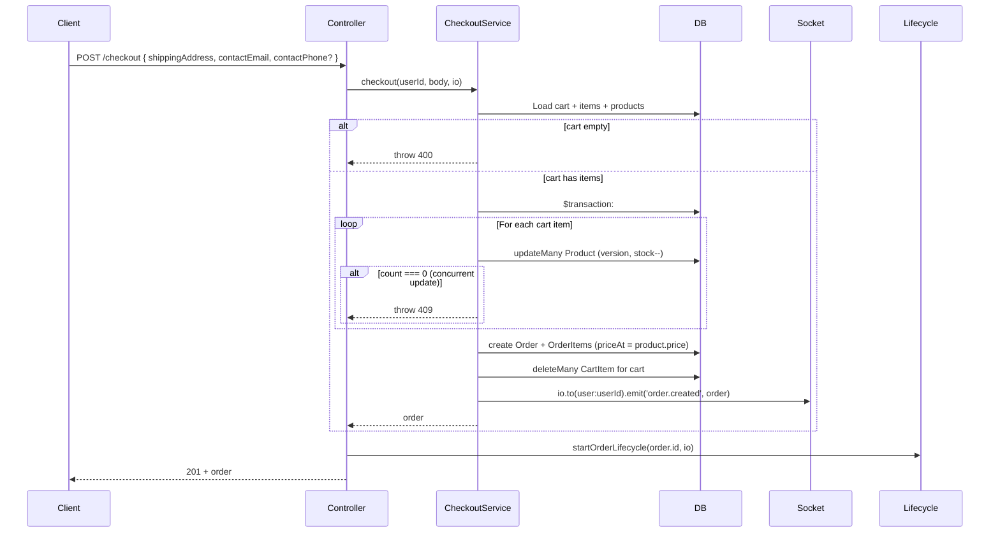
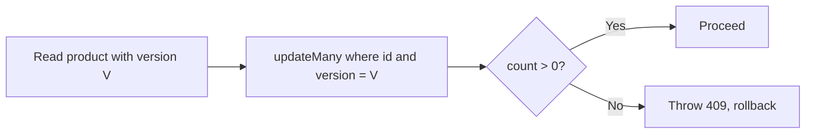
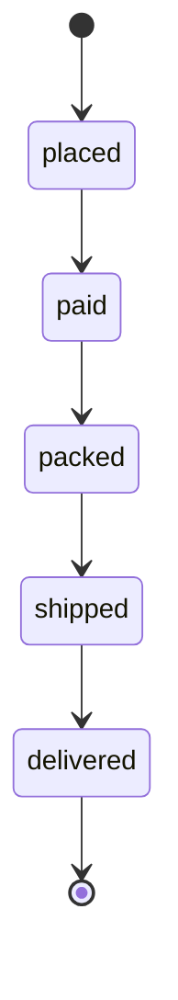

# 07 — Checkout & orders

This doc explains **checkout** (turning the cart into an order), **optimistic locking** to avoid overselling, **order lifecycle** (demo status progression), and how **admin** can change order status.

---

## Checkout: from cart to order

So in one sentence: **load cart → in one transaction decrement stock (with version check), create order and order items, clear cart → emit `order.created` → start lifecycle → return order.**

---

## Why a transaction?

Checkout does several things that must **all succeed or all fail**:

1. Decrement **stock** for every product in the cart (and increment **version**).
2. **Create** the **Order** and all **OrderItems** (with `priceAt` = current product price).
3. **Delete** all **CartItem** rows for that cart.

If we did them one-by-one without a transaction and something failed in the middle, we could end up with stock decreased but no order, or an order but cart still full. So the service runs everything inside **prisma.$transaction(async (tx) => { ... })**: all DB work uses `tx` (the transaction client). If any step throws, the whole transaction is rolled back.

---

## Optimistic locking (Product.version)

**Problem:** Two users check out at the same time; both have the same product in the cart. Without care, we could decrement stock once per checkout and end up with **negative stock** (overselling).

**Idea:** Each product has a **version** field. When we update stock, we do:

- `updateMany({ where: { id: productId, version: currentVersion }, data: { stock: { decrement: qty }, version: { increment: 1 } } })`

So we only update the row **if** the version is still the one we read. If someone else already updated that product (and thus incremented version), our `where` won’t match and **count** will be 0. We then **throw** (e.g. 409) and tell the user to retry. That’s **optimistic locking**: we assume no conflict; if the update affects 0 rows, we know there was a conflict and we abort the transaction.

---

## Order creation details

- **Order** fields: `userId`, `status: "placed"`, `shippingAddress`, `contactEmail`, `contactPhone`.
- **OrderItem** for each cart line: `productId`, `quantity`, **priceAt** = product’s current price (so we store the price at purchase time).
- After the transaction, the service **emits** `order.created` to the room `user:${userId}` if `io` was passed. The frontend can listen for this and show the new order.

---

## Order lifecycle (demo)

**File:** `apis/src/services/orderLifecycle.ts`

**Purpose:** Simulate status progression for demo: **placed → paid → packed → shipped → delivered**. In production you’d use a job queue or external events; here it’s done with **setTimeout** (e.g. 5 seconds between steps).

**Flow:**

1. After checkout, the controller calls `startOrderLifecycle(orderId, io)`.
2. The function advances through `STATUS_FLOW`; every 5s it:
   - Updates the order’s `status` in the DB to the next value.
   - Loads the full order (with items).
   - Emits **order.status_updated** to `user:${order.userId}` with `{ orderId, status, order }`.
   - Schedules the next step (or stops when “delivered”).

So the client can listen for **order.status_updated** and update the UI (e.g. progress bar or status badge) without polling.

---

## Admin: force order status

**Route:** PATCH /admin/orders/:id/status with body `{ status }`. Requires JWT + **admin** role.

**Flow:** Controller gets `id` and body, optionally gets `io` from `req.app.get("io")`, and calls **adminService.setOrderStatus** (which in turn uses **orderService.updateOrderStatus**). That:

1. Updates the order’s `status` in the DB.
2. If `io` is present, emits **order.status_updated** to the **order’s user** room: `user:${order.userId}`.

So both the **lifecycle** and **admin** use the same event name and similar payload; the client just listens for **order.status_updated** and refreshes the order or UI.

---

## Order service (list & get)

- **listOrders(user)** — `prisma.order.findMany({ where: { userId: user.sub }, include: items + product, orderBy: createdAt desc })`. So each user sees only their orders.
- **getOrderById(orderId, user)** — Load order; if not found → 404; if `order.userId !== user.sub` and `user.role !== "admin"` → 403; else return order. So users see only their own orders unless they’re admin.

---

## Summary

| Topic | What happens |
|-------|----------------|
| **Checkout** | Cart → one DB transaction: decrement stock (with version check), create order + items, clear cart; emit `order.created`; start lifecycle; return order. |
| **Optimistic locking** | Product.version; update only if version matches; if count 0 → 409 and rollback. |
| **Order lifecycle** | Demo: every 5s move status placed→paid→packed→shipped→delivered; emit `order.status_updated` each time. |
| **Admin status** | PATCH order status; emit `order.status_updated` to that order’s user room. |

Next: [08 — Real-time (Socket.io)](./08-realtime.md) (WebSockets, rooms, events).
