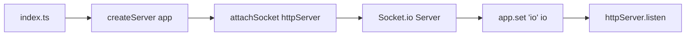
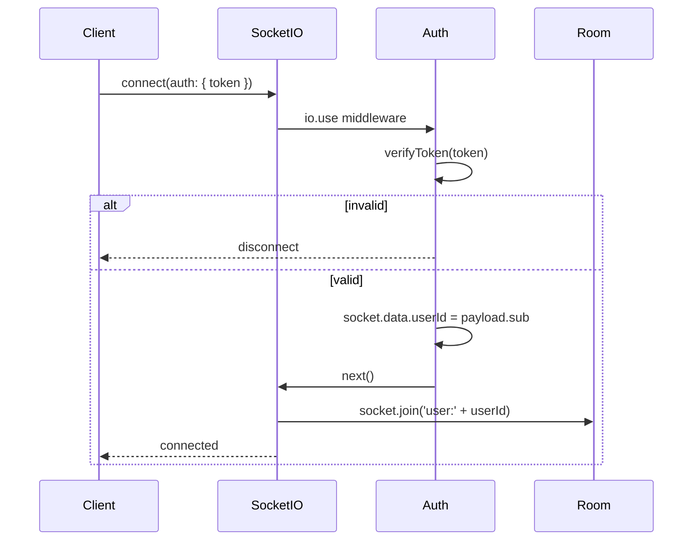

# 08 — Real-time (Socket.io)

This doc explains how **real-time** updates work: **Socket.io** attached to the same HTTP server, **authentication** with JWT, **user rooms**, and the events the server emits (**order.created**, **order.status_updated**).

---

## Why Socket.io?

The API is **REST** over HTTP: the client asks for data when it needs it. For **live** updates (e.g. “your order status changed”), we’d otherwise have to **poll** (repeated GET requests). **Socket.io** gives a **persistent connection** so the server can **push** events to the client as they happen. So after checkout, the client can hear “order created” and “order status updated” without refreshing.

---

## Where Socket.io is set up

- **index.ts** creates the HTTP server with the Express app, then calls **attachSocket(httpServer)** from `socket.ts`. That returns the Socket.io server instance.
- The same **io** is stored on the app with **app.set("io", io)** so route handlers can do `req.app.get("io")` and emit to rooms.

---

## Socket attachment and auth

**File:** `apis/src/socket.ts`

**attachSocket(httpServer)** does:

1. **Create** a Socket.io server attached to the same HTTP server (same port as the API).
2. **CORS:** Use same origins as the API (e.g. from `CORS_ORIGINS`).
3. **Middleware (io.use):** Before a socket is considered “connected”, run an auth step:
   - Read **token** from `socket.handshake.auth.token` (client must send this when connecting).
   - If no token → `next(new Error("Auth required"))` (connection rejected).
   - Otherwise **verify** the token with **JWT_ACCESS_SECRET** (same as HTTP access token).
   - On success: set **socket.data.userId = payload.sub** and `next()`.
   - On failure: `next(new Error("Invalid token"))`.
4. **On connection:** Get `userId` from `socket.data.userId`, compute room name **user:${userId}**, and **socket.join(room)**. So each user’s sockets are in a room only that user is in.
5. **On disconnect:** Optional logging.

So: **only authenticated clients** get a socket, and each socket is placed in **exactly one user room** (per user id). The server can then emit to **one user** with `io.to("user:${userId}").emit(...)`.

---

## Emitting events to the user

The backend emits two event types to the **user room**:

| Event | When | Payload (concept) |
|-------|------|--------------------|
| **order.created** | Right after checkout (inside checkoutService, if `io` is set). | The created **order** (full object with items, etc.). |
| **order.status_updated** | When order status changes: either from **orderLifecycle** (demo) or from **admin** PATCH order status. | `{ orderId, status, order }`. |

In code it’s always:

- `io.to(\`user:${userId}\`).emit("order.created", order)`
- `io.to(\`user:${order.userId}\`).emit("order.status_updated", { orderId, status, order })`

So the **client** that connected with that user’s access token will be in the room and receive these events. Other users won’t.

---

## How the client should connect (concept)

1. **When the user is logged in**, take the **access token** and connect to the same origin (e.g. `http://localhost:4000`) with Socket.io.
2. In the handshake, send the token: e.g. `auth: { token: accessToken }`.
3. Listen for **order.created** and **order.status_updated** and update your UI (e.g. orders list, order detail page).

If the token expires, the socket might get disconnected; the client can refresh the token and reconnect.

---

## Summary

| Piece | Role |
|-------|------|
| **socket.ts** | Attach Socket.io to HTTP server; auth via JWT in handshake; put socket in `user:${userId}` room. |
| **app.set("io", io)** | Let HTTP handlers (checkout, admin) get the same `io` and emit to user rooms. |
| **order.created** | Emitted after checkout to the ordering user’s room. |
| **order.status_updated** | Emitted when status changes (lifecycle or admin) to that order’s user room. |

Next: [09 — Utilities & lib](./09-utilities-and-lib.md) (JWT, hash, errors, logger, Prisma client).
