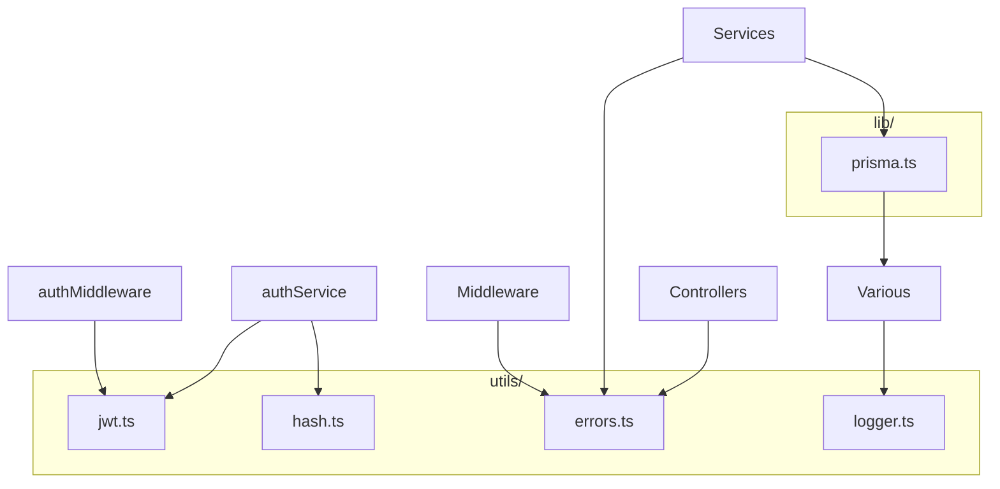

# 09 — Utilities & lib

This doc briefly explains the **shared utilities** and **lib** used across the backend: **JWT**, **hashing**, **errors**, **logger**, and the **Prisma client**.

---

## Overview

---

## 1. JWT — `utils/jwt.ts`

**Purpose:** Sign and verify **JSON Web Tokens** (access and refresh). Used by auth service (sign) and auth middleware / Socket.io (verify).

**Exports:**

- **TokenPayload** — Type: `{ sub: string; email: string; role: string; iat?; exp? }`. `sub` is the user id.
- **signAccessToken(payload, secret, expiresIn)** — Returns a JWT string (e.g. for 15m). Payload usually has `sub`, `email`, `role`.
- **signRefreshToken(payload, secret, expiresIn)** — Same idea, payload often only `{ sub }`, longer expiry (e.g. 7d).
- **verifyToken(token, secret)** — Verifies signature and expiry; **throws** if invalid. Returns the decoded payload (generic `T` for refresh vs access).

Secrets come from env: `JWT_ACCESS_SECRET`, `JWT_REFRESH_SECRET`. Expiry from `JWT_ACCESS_EXPIRES_IN`, `JWT_REFRESH_EXPIRES_IN`.

---

## 2. Hash — `utils/hash.ts`

**Purpose:** Safely handle **passwords**: hash before storing, compare on login. Uses **bcrypt** (via `bcryptjs`).

**Exports:**

- **hashPassword(plain)** — Returns a promise of the hashed string (with a fixed salt rounds). Used on **register** (and in seed).
- **verifyPassword(plain, hash)** — Returns a promise of **boolean**: true if the plain password matches the hash. Used on **login**.

Passwords are **never** stored in plain text; only the hash is in the User table.

---

## 3. Errors — `utils/errors.ts`

**Purpose:** One **error class** the app uses for **intentional** error responses (4xx, etc.) so the **error handler** can send the right status and body.

**AppError:**

- `constructor(statusCode: number, message: string, details?: unknown)`
- Extends `Error`; has `name = "AppError"`.
- **statusCode** — e.g. 400, 401, 403, 404, 409.
- **message** — Short message for the client.
- **details** — Optional (e.g. Zod validation details).

Services and middleware **throw** or **next(new AppError(...))**. The global error handler checks `err instanceof AppError` and sends `res.status(err.statusCode).json({ statusCode, message, details })`. Any other error becomes 500.

---

## 4. Logger — `utils/logger.ts`

**Purpose:** Structured **logging** (JSON in production, readable in dev) so we can trace requests and errors without `console.log`.

**Export:** A **pino** logger instance:

- **Level** from `LOG_LEVEL` (default `"info"`).
- In **development** (`NODE_ENV !== "production"`), uses **pino-pretty** with color for easier reading.
- Usage: `logger.info({ key: value }, "Message")`, `logger.error({ err }, "Message")`, `logger.debug(...)`.

Used in index (server start), auth middleware (debug on JWT failure), error handler (error log), socket (connect/disconnect), and prisma (query log in dev).

---

## 5. Prisma client — `lib/prisma.ts`

**Purpose:** A **single** Prisma client instance for the whole app. All services that need the DB import this same instance.

**What it does:**

- Creates **new PrismaClient()**.
- In **development**, enables **query logging** (emits to pino at debug): every SQL query is logged.
- Exports **prisma** so services do `import { prisma } from "../lib/prisma.js"` and then `prisma.user.findMany()`, `prisma.$transaction(...)`, etc.

Prisma connects lazily; no explicit “connect” call is needed in app code.

---

## Usage summary

| Utility / lib | Used by | Purpose |
|--------------|--------|--------|
| **jwt** | authService, authMiddleware, socket | Sign access/refresh; verify token. |
| **hash** | authService, seed | Hash password on register; verify on login. |
| **errors** | Services, middleware, controllers | Throw or pass AppError for 4xx/5xx. |
| **logger** | index, auth, errorHandler, socket, prisma | Structured logs. |
| **prisma** | All services that touch DB | Single DB client. |

This is the end of the backend docs. You can go back to the [docs index](./README.md) or to the [overview](./01-overview.md) for the big picture.
